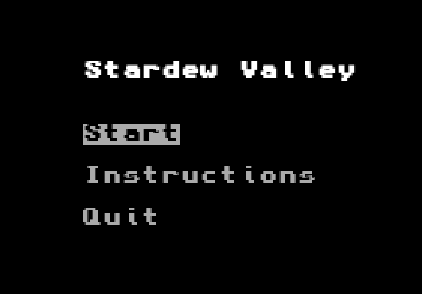
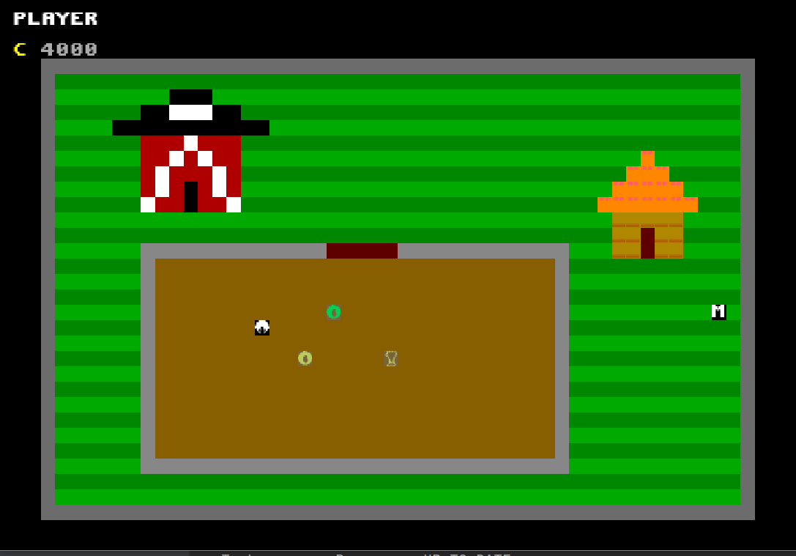
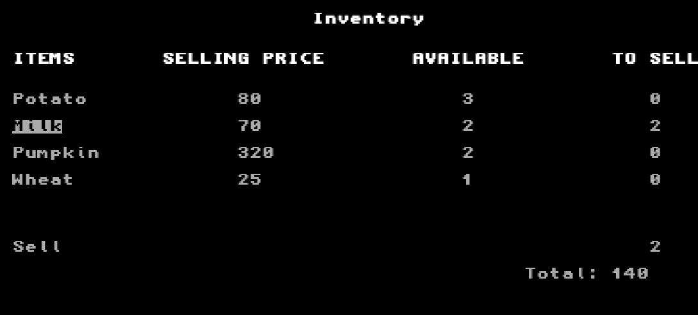
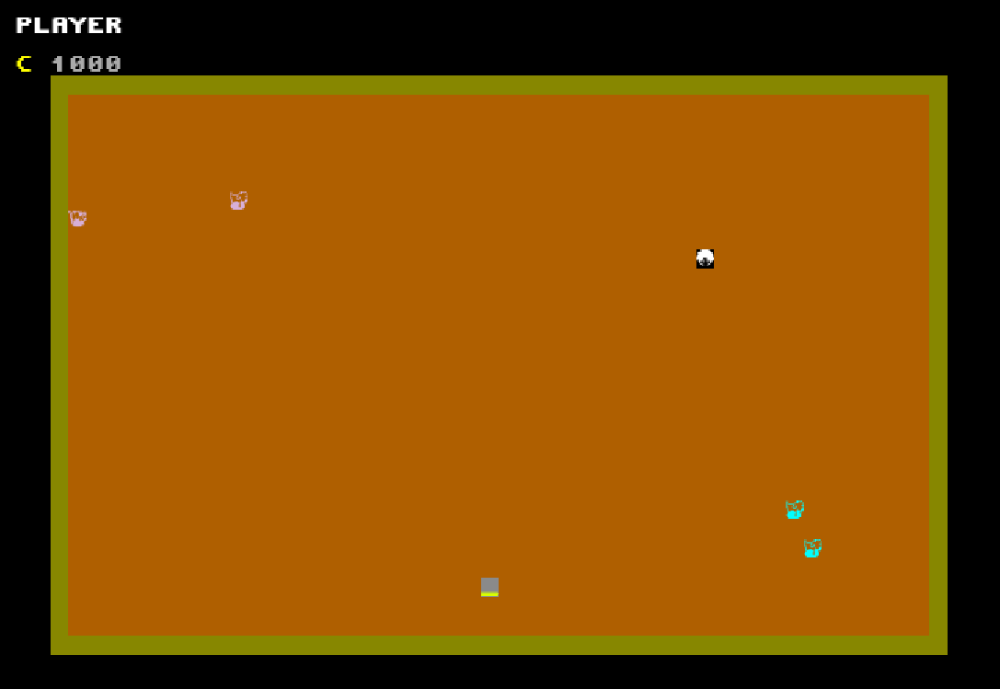
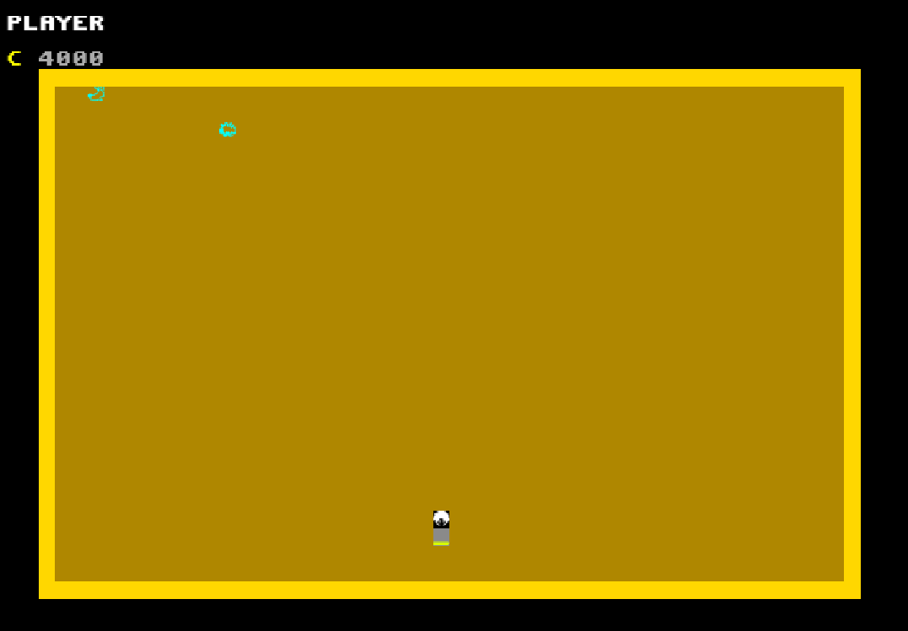
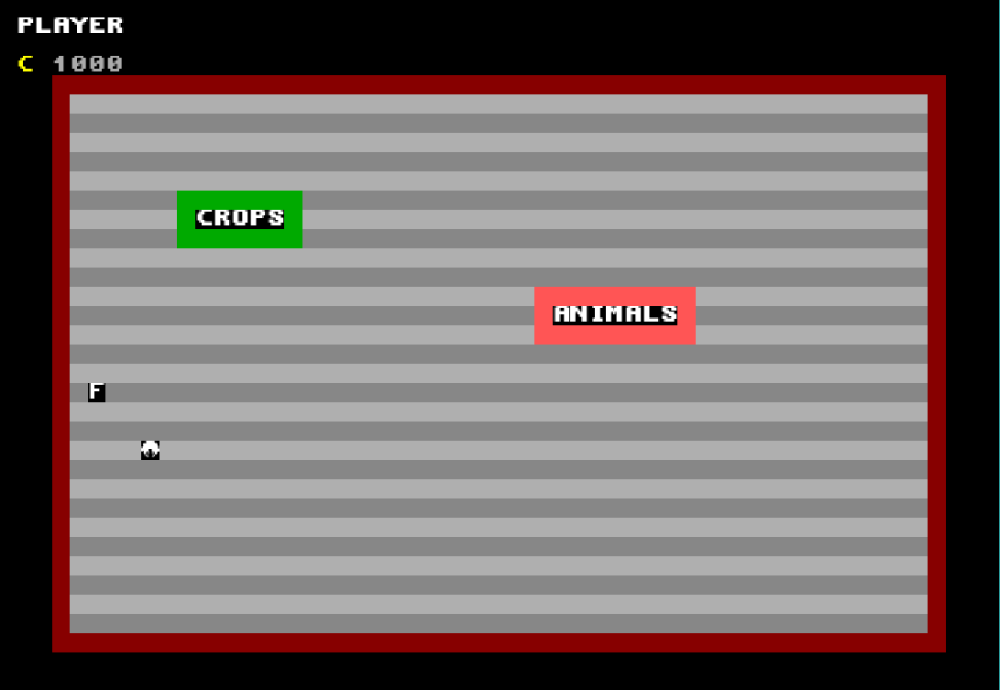
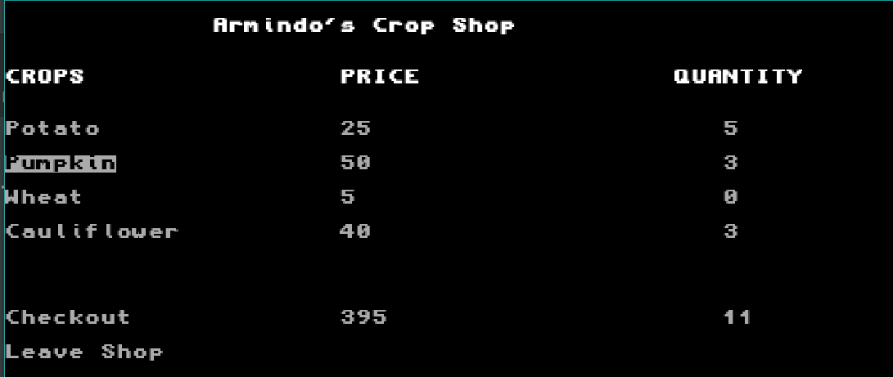
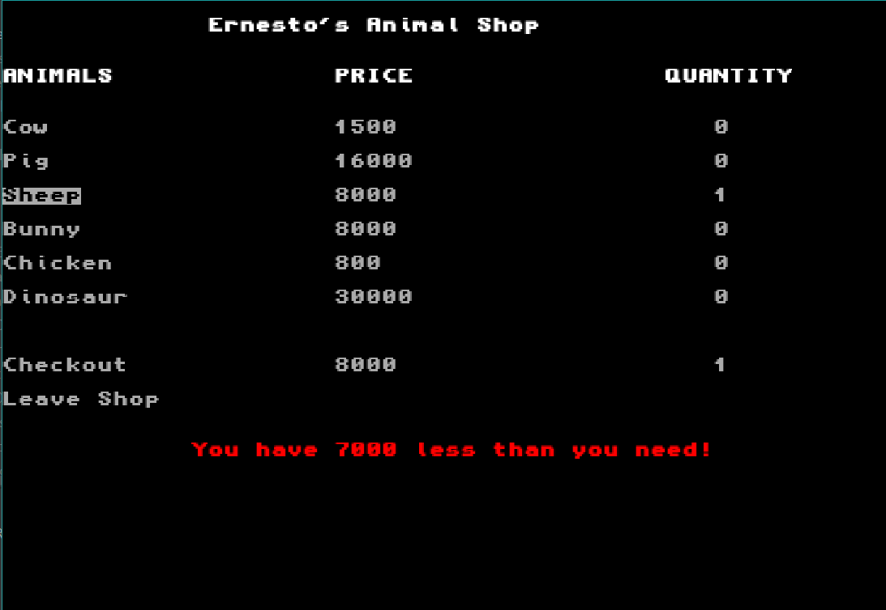

# LPOO_55 - Stardew Valley

> **_Stardew Valley_** é um jogo do tipo _singleplayer_ que, neste caso, se trata de um agricultor.

> Inicialmente é apresentado o **Menu Principal**, onde é possível:
> - ``Start Game`` - começar o jogo;
> - ``Instructions`` - visualizar as instruções;
> - ``Quit`` - sair do ecrã de jogo.
>
> 

> ## Quinta
> Ao selecionar ``Start Game``, o jogador encontra-se agora na quinta, com um saldo inicializado a 4000 moedas.
>
> Aqui, pode:
> - mover-se, utilizando as setas correspondentes;
> - ``C`` plantar (_crop_), se dentro do terreno designado para;
> - ``H`` colher (_harvest_), se se encontrar numa posição onde esteja uma planta. Face a este comando, um de três cenários se pode desencadear:
>   - se tentar colher uma planta cujo estado de desenvolvimento é inferior a _READY_, nada acontecerá;
>   - se tentar colher uma planta cujo estado de desenvolvimento é _READY_, será adicionada a planta, em estado _HARVESTED_, ao seu inventário;
>   - se tentar colher uma planta cujo estado de desenvolvimento é _DEAD_, a planta desaparecerá, mas não será adicionada ao seu inventário;
> - ``W`` regar (_water_), se se encontrar numa posição onde esteja uma planta, o que impede que a mesma passe para o estado de desenvolvimento _DEAD_;
> - ``I`` visualizar o inventário — aqui ser-lhe-á também dada a opção de vender os itens;
> - ``Q`` sair do jogo.
>
> 
>  

> ### Inventário
> 
> 
> Para manipular o inventário e eventualmente vender os itens, basta:
> - ``Enter`` adicionar ao carrinho de compras, efetivar a compra ou sair da loja, se selecionada a opção correspondente;
> - ``Backspace`` remover do carrinho de compras;

> ## _Barn_ e _Coop_
> Os animais encontram-se distribuídos por dois espaços — **_Barn_** e **_Coop_** —, cujo acesso se dá ao colocar o _player_ na posição de entrada.
> 
> > ### _Barn_
> > Pode conter vacas, porcos e ovelhas.
> >
> > 
> 
> > ### _Coop_
> > Pode conter coelhos, galinhas e dinossauros.
> >
> > 
>
> Nestes espaços, o _player_ pode:
>
> - mover-se, utilizando as setas correspondentes;
> - ``C`` cuidar de todos os animais do edifício onde se encontra;
> - ``Q`` sair do jogo.
>
> O regresso à quinta dá-se ao colocar o player na posição de saída.

> ## Mercado
> Para obter novas sementes e/ou novos animais, o _player_ tem, à sua disposição, o **Mercado**, local constituído por lojas cujo acesso se dá ao colocar o _player_ na posição de entrada.
>
> No mercado, o _player_ pode:
> - mover-se, utilizando as setas correspondentes;
> - ``Q`` sair do jogo.
>
> 
> 
> Ao entrar numa **Loja**, o _player_ é redirecionado para o menu correspondente à mesma, onde pode:
> - ``Enter`` adicionar ao carrinho de compras, efetivar a compra ou sair da loja, se selecionada a opção correspondente;
> - ``Backspace`` remover do carrinho de compras;
>
> O **Mercado** tem as seguintes lojas:
> > ### _Crop Shop_
> > Loja de sementes.
> >
> > 
> 
> > ### _Animal Shop_
> > Loja de animais.
> >
> > 
