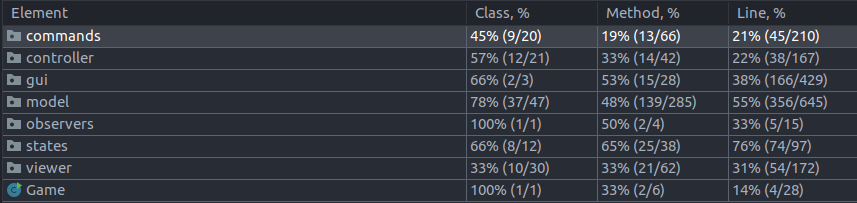

# LPOO_55 - Stardew Valley

> A nossa versão do videojogo **_Stardew Valley_** é do tipo _singleplayer_ e o jogador executa tarefas dentro da sua quinta.
> Este pode, a título de exemplo, plantar, cuidar de animais e comprar bens no mercado da vila.

> Trabalho desenvolvido por:
> - Margarida Vieira, up201907907
> - Beatriz Lopes dos Santos, up201906888
> - Miguel Rodrigues, up201906042

> ## _Features_ Implementadas
> O _player_ pode, ao carregar na tecla correspondente:
> > **Na Quinta:**
> > - mover-se, utilizando as setas correspondentes;
> > - ``C`` plantar, se na área designada para 
> > - ``H`` colher, se se encontrar numa posição onde esteja uma planta
> >  - se tentar colher uma planta em estado inferior ao _READY state_, nada acontecerá;
> >  - se tentar colher uma planta em _READY state_, a mesma será adicionada, em _HARVESTED state_, ao seu inventário;
> >  - se tentar colher uma planta em _DEAD state_, a planta desaparecerá, mas não será adicionada ao seu inventário;
> > - ``W`` regar, se se encontrar numa posição onde esteja uma planta, o que impede que a mesma passe para _DEAD state_;
> > - ``I`` visualizar o inventário — aqui ser-lhe-á também dada a opção de vender os itens;
> > - ``Q`` sair do jogo.
> 
> > **No _Barn_ e no _Coop_:**
> > - mover-se, utilizando as setas correspondentes;
> > - ``C`` cuidar de todos os animais do edifício onde se encontra e possível que estes se tornem _"ready to produce"_;
> > - se passar por um animal dito _"ready to produce"_, visível através da sua cor azul, será automaticamente feita a colheita do produto correspondente, que é adicionado ao seu inventário.
> 
> > **No Mercado:**
> > - mover-se, utilizando as setas correspondentes;
> > - entrar nas lojas disponíveis, bastando para tal dirigir-se à posição correspondente à entrada.
> 
> > **No menu das Lojas:**
> >
> > Neste menu, o carrinho destina-se a guardar os itens que serão comprados.
> > - ``Enter`` adicionar uma unidade do item selecionado ao carrinho, efetivar a compra e sair da loja;
> > - ``Backspace`` remover uma unidade do item selecionado do carrinho;
> >
> > Ao efetivar a compra, a quantidade de dinheiro gasta é subtraída do saldo do _player_ e os itens comprados são adicionados ao seu inventário.
> 
> > **No menu do Inventário:**
> >
> > Neste menu, o carrinho destina-se a guardar os itens que serão vendidos.
> > - ``Enter`` adicionar uma unidade do item selecionado ao carrinho e efetivar a venda;
> > - ``Backspace`` remover uma unidade do item selecionado do carrinho;
> > - ``Esc`` sair do inventário e desistir da venda.
> >
> > Ao efetivar a venda, a quantidade de dinheiro adquirida é somada ao saldo do _player_ e os itens vendidos são removidos ao seu inventário.

> ## _Features_ Planeadas
> Em termos de _features_ idealizadas e que não foram efetivamente implementadas pode referir-se:
> - permitir ao _player_ pescar, caçar e minerar;
> - alargar o mapa para além da quinta e mercado;
> - possuir uma maior variedade maior;
> - fazer o _upgrade_ dos edifícios;
> - permitir ao jogador customizar a sua aparência;
> - guardar o estado atual do jogo em ficheiros, para permitir criar perfis e retomar ao jogo de cada.

> ## _Design Problems_
> 
> > ### 1. Construção da quinta e dos edifícios
> > #### Contexto do problema
> > A inicialização da Quinta e dos edifícios destinados a guardar os animais — _Barn_ e _Coop_ —, requeria um conjunto considerável de passos.
> > #### Padrão utilizado
> > Foi implementado o **_Builder Pattern_**.
> > #### Implementação
> > 
> > #### Consequências
> > O recurso ao _design pattern_ referido permitiu construir os ditos objetos passo a passo.
> > Para além disso, tornou o código mais extensível no sentido em que, mais tarde, poderiam facilmente vir a ser implementadas outras formas de construir os objetos, sem ter que alterar o seu construtor, dado que os detalhes da construção apenas seriam conhecidos pelo método responsável por tal tarefa.
> 
> > ### 2. Crescimento das sementes
> > #### Contexto do problema
> > As sementes, assim que plantadas, têm que mudar de estado após um certo intervalo de tempo definido, o que se reflete, visualmente, na sua cor. 
> > Para além disso, quando uma semente é regada, tal ação deve ter como consequência o _reset_ do tal intervalo de tempo que determina a passagem da semente para o próximo estado, impedindo, assim, que esta atinja o estado _dead_.
> > #### Padrão utilizado
> > Foi implementado o **_Observer Pattern_**.
> > #### Implementação
> > Ao ser plantada uma semente, ela é adicionada à lista de sementes e, simultaneamente, é adicionado um observador dessa semente à lista de observadores, ambas da Quinta.
> > Em cada _loop_ do jogo, todos os observadores presentes na lista são chamados a atualizar o estado da semente que lhe fora designada, se aplicável.
> > 
> > #### Consequências
> > O recurso ao _design pattern_ referido permitiu desprender as responsabilidades pelas ações referidas da Quinta, uma vez que passa a ser responsabilidade de cada um dos observers efetuar alguma alteração da sua semente, se necessário.
>
> > ### 3. Implementação dos menus
> > #### Contexto do problema
> > Existiam vários menus, cada um deles com um número considerável de _entries_ que constituíam ações a ser levadas a cabo. 
> > #### Padrão utilizado
> > Foi implementado o **_Command Pattern_**. 
> > #### Implementação
> > 
> > #### Consequências
> > O recurso ao _design pattern_ referido permitiu simplificar significativamente a implementação dos menus, uma vez que passou a ser necessário apenas chamar o método _execute_ do comando correspondente à _entry_ selecionada e passou a ser responsabilidade de cada comando saber que _action_ despoletar.
>
> > ### 4. Mapeamento para o _viewer_ correspondente
> > #### Contexto do problema
> > Face à quantidade considerável de objetos e de forma a não guardar informação de como desenhar o objeto no ecrã no _model_, o que constituiria uma violação dolosa do modelo _MVC_, teve que se arranjar uma estratégia para mapear o _viewer_ genérico para o _viewer_ concreto.
> > #### Padrão utilizado 
> > Foi implementado o **_Factory Method Pattern_**.
> > #### Implementação
> > A implementação é tão simples como invocar o método _draw_ da _factory_ correspondente, o qual, por sua vez, invoca o método _draw_ do _viewer_ concreto.
> > 
> > #### Consequências
> > Tal abordagem desbloqueou a possibilidade de, ao longo do código, se lidar apenas com _viewers_ genéricos. Por outro lado, o mapeamento constitui, ele mesmo, um _code smell_ dado que foi necessário recorrer a uma quantidade significativa de _if conditions_.

> ## _Code Smells_
> - _**Large class**_;
> - _**Duplicate code**_;
> - _**Data class**_;
> - _**Data clumps**_;
> - _**Switch Statements**_;
> - etc.

> ## Testes
> [Mutation Testing Report](../build/reports/pitest/202105092123/index.html)
> 
> 

> ## Avaliação dos membros
> - Margarida Vieira: 33.33%
> - Beatriz Lopes dos Santos: 33.33%
> - Miguel Rodrigues: 33.33%